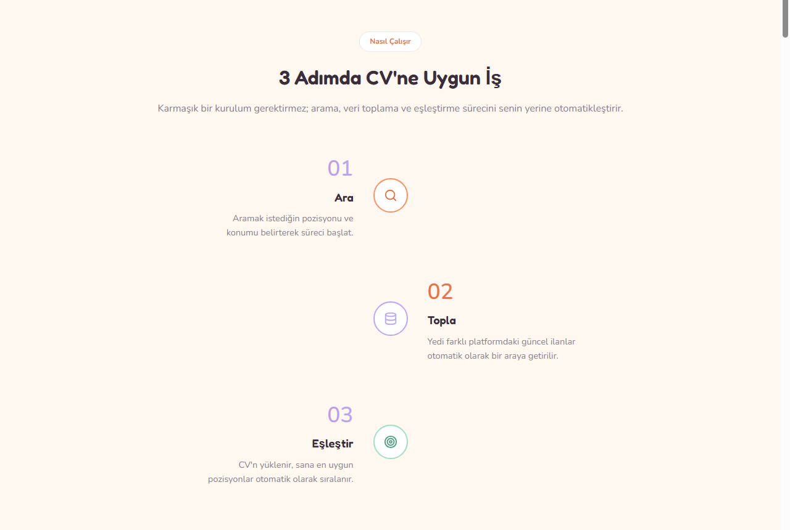

# Cupeer — cupid for your career

Cupeer is a personal, end-to-end job recommendation system: upload your CV
and it ranks fresh listings pulled from 7 different job platforms (LinkedIn,
Indeed, Upwork, Kariyer.net, Eleman.net, Glassdoor, RemoteOK) by how well
they match you.

Upload your CV, let Cupeer find the jobs that fit you best, and optionally
have it write a tailored cover letter for any listing you pick.




## Features

- **Scrape 7 platforms at once** — pulls listings from LinkedIn, Indeed,
  Upwork, Kariyer.net, Eleman.net, Glassdoor and RemoteOK via Apify Actors.
- **Semantic matching** — compares your CV and each listing with a
  multilingual (TR/EN) embedding model and ranks by meaning, not just
  keyword overlap.
- **Country-aware filtering** — every listing is tagged with the country it
  was scraped for, so filtering by "Turkey" or "USA" only shows jobs from
  that country.
- **Freshness tracking** — expired or stale listings (based on the source's
  own signal and the posting date) are automatically filtered out.
- **AI-generated cover letters** — writes a cover letter tailored to your CV
  and a chosen listing, downloadable as a PDF.
- **Runs locally** — your data stays on your machine; the only external
  dependencies are scraping (Apify) and cover letter generation (Gemini).

## Tech stack

| Layer | Technology |
|---|---|
| Backend | FastAPI, Pydantic |
| Scraping | Apify Python SDK |
| Recommendation model | sentence-transformers (multilingual embeddings) |
| Storage | SQLite |
| Cover letter generation | Google Gemini API |
| PDF generation | fpdf2 |
| Frontend | Static HTML/CSS/JS (served from the same origin via FastAPI `StaticFiles`) |

## Setup

```bash
git clone https://github.com/gizemyalcinn/cupeer.git
cd cupeer
python -m venv venv
venv\Scripts\activate        # Windows
# source venv/bin/activate   # macOS/Linux

pip install -r requirements.txt
```

Copy `.env.example` to `.env` and fill in your own API keys:

```bash
cp .env.example .env
```

```
APIFY_API_TOKEN=...   # from https://console.apify.com
GEMINI_API_KEY=...    # from https://aistudio.google.com
```

## Running

```bash
uvicorn src.api.main:app --reload
```

Then open `http://127.0.0.1:8000` in your browser. The frontend is served
from the same origin as the backend, so there's no separate server to set up.

## Tests

Unit tests that don't depend on any external service (Apify, Gemini) —
fully local and free — live in `tests/`:

```bash
pytest
```

Files under `scripts/manual/` are not automated tests — they're scripts
written during development to manually verify individual platforms, and they
make real (paid) API requests when run. Run them intentionally, not as part
of any test suite.

## A note on cost

Apify and Gemini both offer free tiers, but they're limited. This project
calls both only when needed, with low `max_items` values by default — still,
keep an eye on your own usage/quota pages when using your own API keys.

## Project structure

```
src/
  api/            FastAPI endpoints
  scraping/       Per-platform scrapers + country detection
  preprocessing/  Shared Job schema, cleaning/deduping
  model/          Embeddings, recommendation, freshness, cover letters
  db/             SQLite storage layer
frontend/         Static HTML/CSS/JS UI
tests/            Automated pytest tests
scripts/manual/   Manual debug scripts used during development
```
