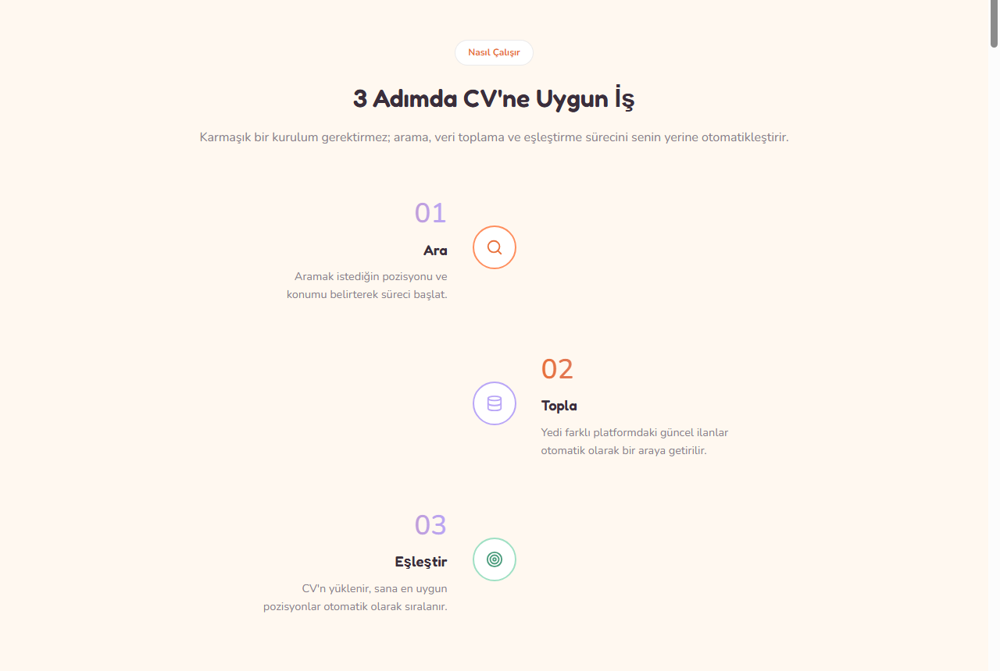
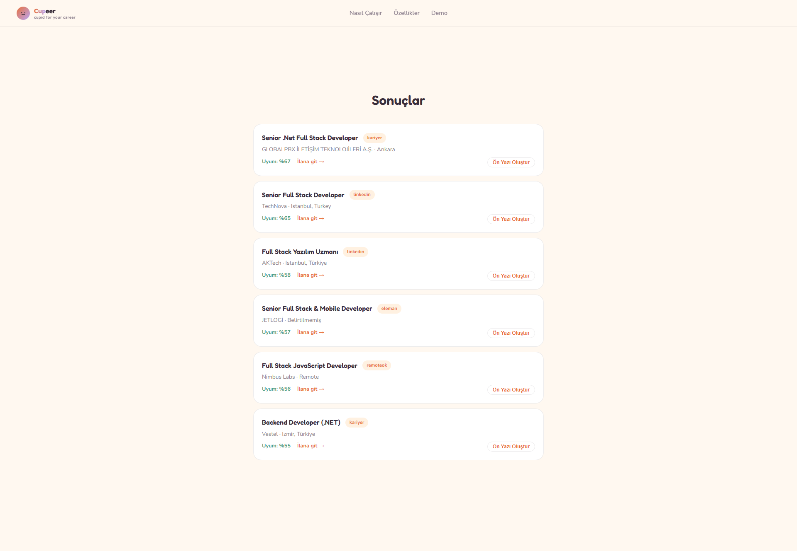

# Cupeer — cupid for your career

Cupeer is a personal, end-to-end job recommendation system: upload your CV
and it ranks fresh listings pulled from 7 different job platforms (LinkedIn,
Indeed, Upwork, Kariyer.net, Eleman.net, Glassdoor, RemoteOK) by how well
they match you.

Upload your CV, let Cupeer find the jobs that fit you best, and optionally
have it write a tailored cover letter for any listing you pick.






## Features

- **Scrape 7 platforms at once** — pulls listings from LinkedIn, Indeed,
  Upwork, Kariyer.net, Eleman.net, Glassdoor and RemoteOK via Apify Actors.
- **Semantic matching** — compares your CV and each listing with a
  multilingual (TR/EN) embedding model and ranks by meaning, not just
  keyword overlap.
- **Country-aware filtering** — every listing is tagged with the country it
  was scraped for, so filtering by "Turkey" or "USA" only shows jobs from
  that country.
- **Freshness tracking** — expired or stale listings (based on the source's
  own signal and the posting date) are automatically filtered out.
- **AI-generated cover letters** — writes a cover letter tailored to your CV
  and a chosen listing, downloadable as a PDF.
- **CV review** — uploads your CV and returns a structured report (overall
  score, per-category scores for ATS compatibility/content impact/format,
  plus concrete strengths and improvements) powered by Gemini.
- **Optional accounts** — sign up with email/password or Google to save
  favorite listings across visits; browsing and getting recommendations
  works fine without an account too.
- **Self-contained** — runs with just a Postgres database plus two
  external APIs: scraping (Apify) and AI features like cover letters
  and CV review (Gemini).

## Tech stack

| Layer | Technology |
|---|---|
| Backend | FastAPI, Pydantic |
| Scraping | Apify Python SDK |
| Recommendation model | Google Gemini embeddings (multilingual) |
| Storage | PostgreSQL |
| Cover letter + CV review generation | Google Gemini API |
| PDF generation | fpdf2 |
| Auth | Session cookies (Starlette `SessionMiddleware`) + bcrypt, Google OAuth via Authlib |
| Frontend | Static HTML/CSS/JS (served from the same origin via FastAPI `StaticFiles`) |

## Setup

```bash
git clone https://github.com/gizemyalcinn/cupeer.git
cd cupeer
python -m venv venv
venv\Scripts\activate        # Windows
# source venv/bin/activate   # macOS/Linux

pip install -r requirements.txt
```

Copy `.env.example` to `.env` and fill in your own API keys:

```bash
cp .env.example .env
```

```
APIFY_API_TOKEN=...      # from https://console.apify.com
GEMINI_API_KEY=...       # from https://aistudio.google.com
DATABASE_URL=...         # PostgreSQL connection string (e.g. a free Render Postgres instance)
SESSION_SECRET_KEY=...   # any random string, e.g. `python -c "import secrets; print(secrets.token_hex(32))"`
GOOGLE_CLIENT_ID=...     # optional, see below
GOOGLE_CLIENT_SECRET=... # optional, see below
```

Email/password accounts work out of the box once `SESSION_SECRET_KEY` is set.
"Sign in with Google" is optional — without `GOOGLE_CLIENT_ID`/`GOOGLE_CLIENT_SECRET`
that button just returns an error, everything else still works. To enable it:

1. Go to the [Google Cloud Console](https://console.cloud.google.com/apis/credentials) and create an OAuth 2.0 Client ID (application type: Web application).
2. Add `http://127.0.0.1:8000/auth/google/callback` as an authorized redirect URI (adjust the domain for production).
3. Copy the generated Client ID and Client Secret into `.env`.

## Running

```bash
uvicorn src.api.main:app --reload
```

Then open `http://127.0.0.1:8000` in your browser. The frontend is served
from the same origin as the backend, so there's no separate server to set up.

## Tests

Unit tests that don't depend on any external service (Apify, Gemini) —
fully local and free — live in `tests/`:

```bash
pytest
```

Files under `scripts/manual/` are not automated tests — they're scripts
written during development to manually verify individual platforms, and they
make real (paid) API requests when run. Run them intentionally, not as part
of any test suite. The exception is `seed_demo_jobs.py`, which inserts a
handful of realistic sample listings straight into the local database — no
API calls, useful for trying out the "Öner" flow without spending Apify
credits.

## Security

What's in place, and where to look:

- **Auth** — bcrypt password hashes, signed `HttpOnly` + `SameSite=Lax` session
  cookies (`Secure` in production), session reset on login, Google sign-in only
  trusts verified e-mails, per-account lockout after 5 failed logins
  (`src/auth/`).
- **Rate limiting** — per-IP sliding-window limits on login, registration and
  every endpoint that costs money or CPU (Gemini, PDF parsing, Apify)
  (`src/api/hardening.py`). In-memory, so it assumes a single worker.
- **Authorization** — scraping new listings (`/refresh`, paid Apify calls)
  requires an account, with per-user and global hourly caps. Favorites are
  always scoped to the session user.
- **Input validation** — length/range limits on every request body; uploads are
  checked for size (5 MB), `%PDF-` magic bytes and page count before parsing.
- **XSS / injection** — all SQL is parameterized; third-party listing data is
  HTML-escaped and links are limited to `http(s)` before rendering; strict CSP.
- **CSRF / CORS** — SameSite cookies plus an `Origin` check on state-changing
  requests; no CORS headers are sent, so the API is same-origin only.
- **Headers** — CSP, HSTS (over HTTPS), `X-Frame-Options`, `nosniff`,
  `Referrer-Policy`, `Permissions-Policy`.
- **Errors & logs** — a global handler returns generic 500s; auth and abuse
  events are logged (`cupeer.audit`) with e-mails hashed, never passwords.
- **Dependencies / CI** — `.github/workflows/security.yml` runs `pip-audit`,
  `bandit` and the tests on every push and weekly; Dependabot opens update PRs.
- **Backups** — `python scripts/backup_db.py backup` / `restore <file>` (output
  goes to the git-ignored `backups/`).

Secrets live only in `.env` / the host's environment variables; the app refuses
to start in production without `SESSION_SECRET_KEY`.

## A note on cost

Apify and Gemini both offer free tiers, but they're limited. This project
calls both only when needed, with low `max_items` values by default — still,
keep an eye on your own usage/quota pages when using your own API keys.

## Project structure

```
src/
  api/            FastAPI endpoints
  auth/           Password hashing, sessions, Google OAuth
  scraping/       Per-platform scrapers + country detection
  preprocessing/  Shared Job/User schemas, cleaning/deduping
  model/          Embeddings, recommendation, freshness, cover letters
  db/             PostgreSQL storage layer
frontend/         Static HTML/CSS/JS UI
tests/            Automated pytest tests
scripts/manual/   Manual debug scripts used during development
```

