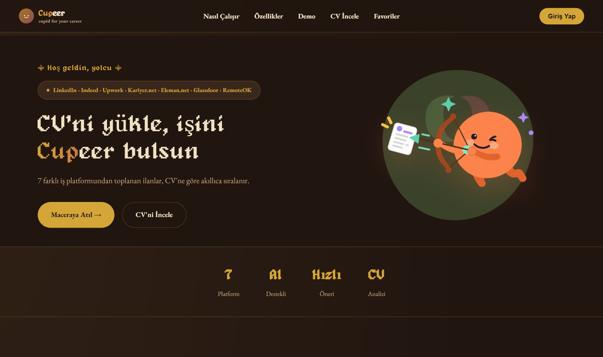
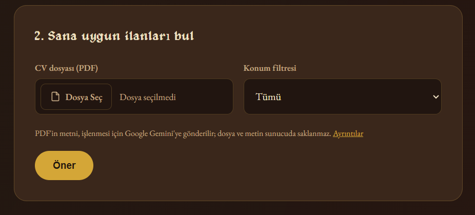
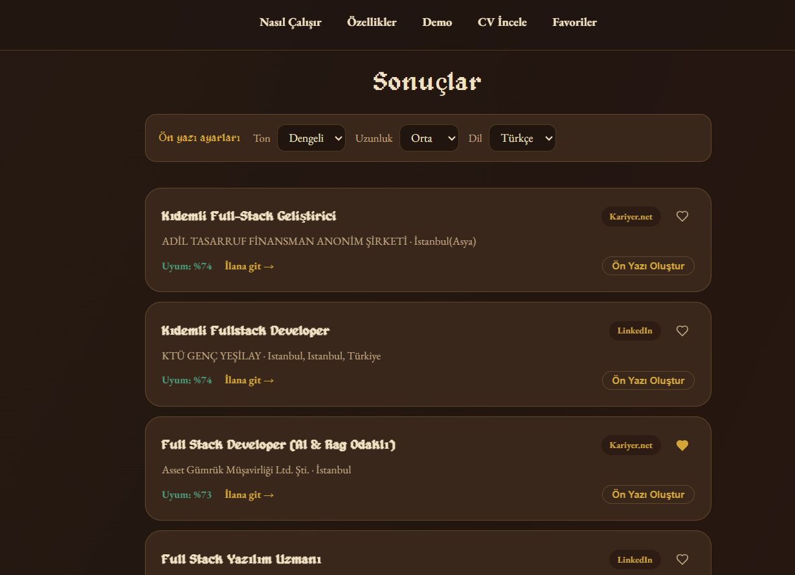
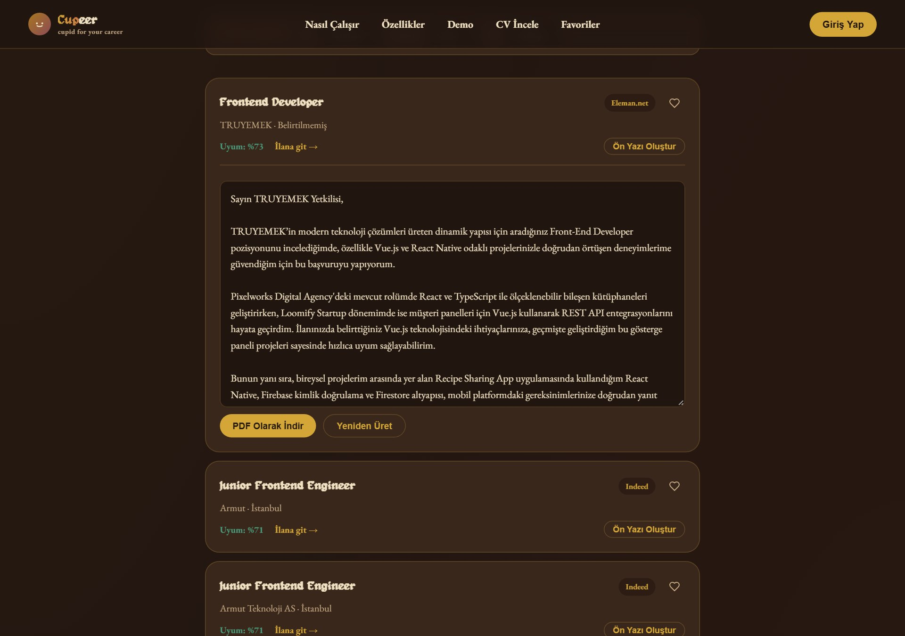
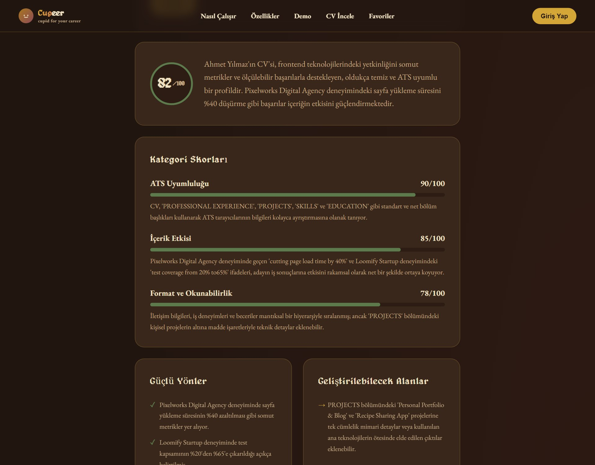
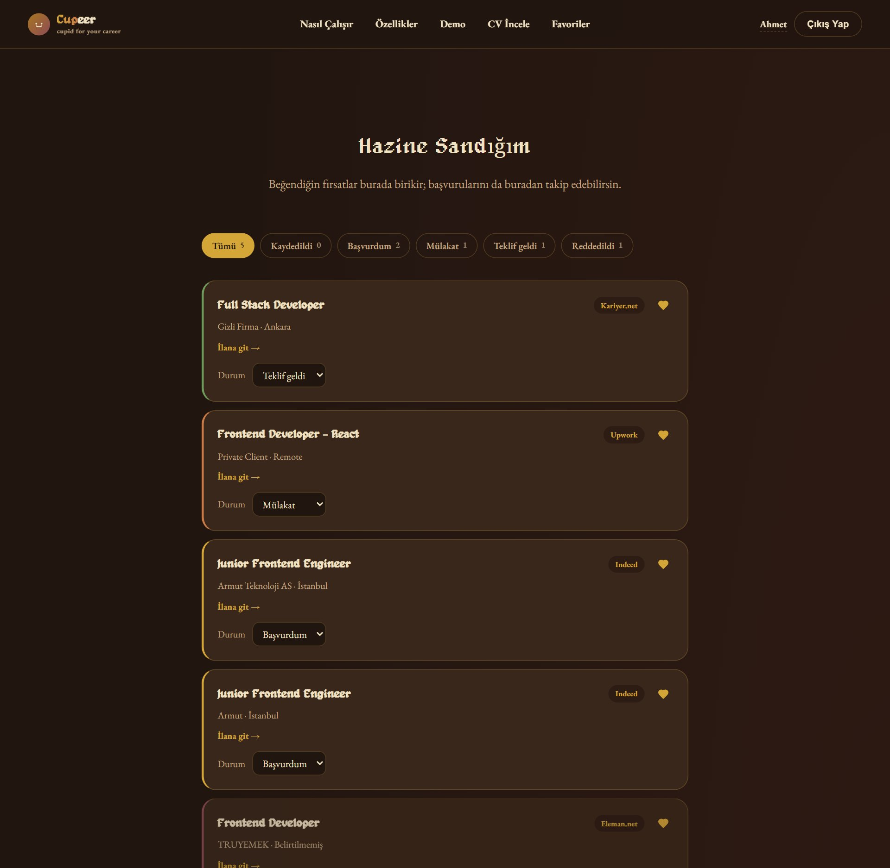
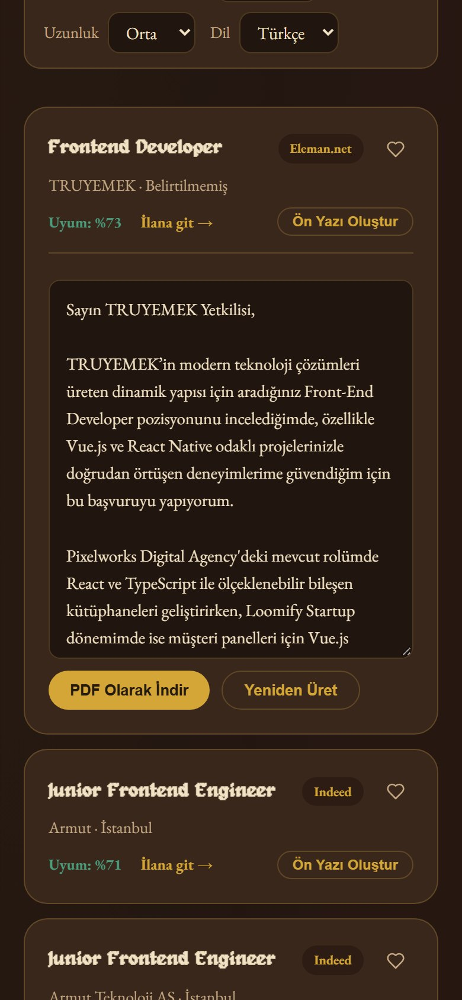

# Cupeer — cupid for your career

Cupeer is a personal, end-to-end job recommendation project. Upload your CV and
it ranks job listings collected from seven platforms (LinkedIn, Indeed, Upwork,
Kariyer.net, Eleman.net, Glassdoor, RemoteOK) by how closely they match you. It
can also write a tailored cover letter, review your CV, and track the
applications you make.

The interface is Turkish and themed as a medieval tavern (Alagard pixel font,
dark wood and gold). The code, comments and this README are mostly English.

**This is a portfolio project, not a public service.** The deployed instance is
private and there is no public demo or installation guide; the screenshots below
show how it looks and what it does. Fetching new listings is paid (Apify), so it
is restricted to the site owner's account and closed to everyone else. The CV
used in the screenshots is a fictional sample.



## What it does

Upload a CV (PDF), optionally pick a country, and press "Öner" to get ranked
listings. The CV text is extracted on the server and is not stored.





- **Semantic matching.** Your CV and every listing are embedded with Gemini's
  multilingual embedding model, so a Turkish CV can match an English listing.
  Ranking is by meaning, not keyword overlap.
- **Cover letters.** Pick a tone (balanced, formal, friendly), a length (short,
  medium, long) and a language (Turkish or English), then edit the result,
  regenerate it, or download it as a PDF.

  

- **CV review.** Upload a PDF and get an overall score, scores for ATS
  compatibility, content impact and format, plus concrete strengths and
  suggestions.

  

- **Application tracking.** Save listings to "Hazine Sandığım" (the treasure
  chest) and mark each as saved, applied, interview, offer or rejected. Filter
  by status.

  

- **Scraping seven platforms.** New listings are pulled through Apify actors,
  cleaned, de-duplicated and embedded. Only new listings are stored.
- **Country-aware filtering.** Each listing is tagged with the country it was
  searched for, so filtering by "Türkiye" or "ABD" only shows jobs from there.
- **Freshness.** Listings the source marks as expired, or posted more than 45
  days ago, are left out of the results.
- **Accounts.** Email and password, or Google sign-in. Browsing, matching, cover
  letters and CV review work without an account; saving favorites needs one.
  Accounts can be deleted from the interface.
- **Works on phones.** Responsive layout, 44 px touch targets, safe-area
  support, and keyboard navigation throughout.

<p align="center">
  
</p>

### What the match percentage means

The "Uyum" percentage is a similarity score between your CV and the listing, not
a probability that you will get the job. It is computed like this:

```
score = 0.6 × cosine(CV, listing title) + 0.4 × cosine(CV, company + location + description)
```

Embeddings come from `gemini-embedding-001` (768 dimensions, normalised), so the
cosine similarity is a plain dot product. The CV is embedded as a retrieval
query and listings as retrieval documents. There is no trained ranking model;
quality depends on the embedding model and on the listing text.

## How it fits together

```
 Apify actors (7 platforms)
        │  scrape            only the site owner can trigger this
        ▼
 clean + de-duplicate ──► Gemini embeddings ──► PostgreSQL (listings, vectors, users, favorites)
                                                       │
 CV (PDF) ──► text ──► query embedding ──► cosine ranking ──► filters (freshness, country)
        │
        └──► Gemini: cover letter, CV review
```

The backend is a single FastAPI app that also serves the static frontend, so
there is no separate frontend build or server.

## Tech stack

| Layer | Technology |
|---|---|
| Backend | FastAPI, Pydantic |
| Scraping | Apify Python SDK (`apify-client` pinned to 2.5.1) |
| Embeddings | Google Gemini `gemini-embedding-001` |
| Cover letters, CV review | Google Gemini (`gemini-flash-lite-latest`, structured output for the review) |
| Storage | PostgreSQL via `psycopg2`, embeddings stored as `BYTEA` |
| PDF in/out | `pdfplumber` (read), `fpdf2` (write) |
| Auth | Starlette `SessionMiddleware` signed cookies, `bcrypt`, Google OAuth via Authlib |
| Frontend | Plain HTML, CSS and JavaScript, no framework or build step |
| Fonts | Alagard and EB Garamond, both self-hosted |
| Hosting | Render (free web service and free Postgres) |

## Tests

An automated test suite (pytest) runs without network access, API keys or a
database. It covers cleaning, country detection, freshness, request validation,
rate limiting, security headers, upload limits, the scraping permission rules,
password strength, the favorite-status endpoint and the cover-letter prompt
options. A GitHub Actions workflow runs it on every push.

## API

| Method | Path | Notes |
|---|---|---|
| `POST` | `/recommend` | Rank stored listings for a CV text |
| `POST` | `/extract-text` | PDF to text |
| `POST` | `/cv-review` | CV review |
| `POST` | `/cover-letter`, `/cover-letter-pdf` | Cover letter text, PDF |
| `POST` | `/refresh` | Scrape and store new listings (owner only) |
| `GET` | `/favorites` | The signed-in user's favorites with their status |
| `POST` | `/favorite`, `/favorite/status` | Add or remove a favorite, change its status |
| `POST` | `/auth/register`, `/auth/login`, `/auth/logout` | Email and password |
| `GET` | `/auth/google/login`, `/auth/google/callback`, `/auth/me` | Google sign-in, current user |
| `POST` | `/auth/delete-account` | Delete the account and its data |

Interactive API docs are switched off on purpose.

## Security

What is in place, and where to look:

- **Auth.** bcrypt password hashes, common and very simple passwords rejected,
  signed `HttpOnly` + `SameSite=Lax` session cookies (`Secure` in production),
  session reset on login, per-account lockout after five failed logins, Google
  sign-in only trusts verified e-mails (`src/auth/`).
- **Paid scraping is owner-only.** `/refresh` costs real Apify credits. It runs
  only for e-mails in `REFRESH_ALLOWED_EMAILS` and only in a session opened
  through Google sign-in, because password sign-up does not verify e-mails. The
  list is empty by default, which keeps the endpoint closed. Per-user and global
  hourly caps apply on top.
- **Rate limiting.** Per-IP sliding windows on login, registration and every
  endpoint that costs money or CPU (`src/api/hardening.py`). In memory, so it
  assumes one worker.
- **Input validation.** Length and range limits on every request body. Uploads
  are checked for size (5 MB), the `%PDF-` signature and page count before being
  parsed, and any request body over 6 MB is rejected early.
- **XSS and injection.** All SQL is parameterised. Third-party listing text is
  HTML-escaped and links are limited to `http(s)`. The content security policy
  allows no third-party hosts.
- **CSRF and CORS.** SameSite cookies plus an `Origin` check on state-changing
  requests. No CORS headers are sent, so the API is same-origin only.
- **Headers.** CSP, HSTS over HTTPS, `X-Frame-Options`, `nosniff`,
  `Referrer-Policy`, `Permissions-Policy`.
- **Errors and logs.** Generic error responses, no stack traces. Auth and abuse
  events go to an audit log with e-mails hashed, never passwords. Old failed
  login attempts are deleted after a day.
- **Dependencies.** A GitHub Actions workflow runs `pip-audit`, `bandit` and the
  tests on every push and weekly; Dependabot opens update PRs.
- **Backups.** A backup and restore script (`scripts/backup_db.py`) writes to a
  git-ignored folder.

Secrets live only in `.env` or the host's environment. In production the app
refuses to start without `SESSION_SECRET_KEY`.

**Known limitation:** e-mail addresses are not verified at sign-up (no mail
service is wired in). That is why the privileged scrape action requires a Google
session instead.

## Privacy

The privacy and terms pages (`/privacy/`, `/terms/`) describe what the deployed app
does. In short: a CV is processed in memory and is never stored, but its text is
sent to Google's Gemini API to produce matches, letters and reviews. The only
cookie is the signed session cookie, so there is no cookie banner. Accounts can
be deleted from the interface. Fonts are served from the site itself, so
visiting it makes no requests to Google.

## Deployment

The project runs privately on Render (a free web service and a free PostgreSQL
instance), auto-deployed from `main`, with a single worker because the rate
limiter is in memory. Render's free Postgres is deleted after about a month, so
backups are taken before it expires. It is not open to the public.

## A note on cost

Apify and Gemini both have free tiers, but they are limited. Scraping is the
costly part, which is why it is restricted to the owner and uses small
`max_items` values by default.

## Project structure

```
src/
  api/            FastAPI app, request limits, security middleware
  auth/           Password hashing, sessions, Google OAuth, scrape permission
  scraping/       One scraper per platform, country detection
  preprocessing/  Shared Job/User schemas, cleaning and de-duplication
  model/          Embeddings, ranking, freshness, cover letters, CV review
  db/             PostgreSQL storage
frontend/         Static HTML/CSS/JS, privacy and terms pages
docs/screenshots/ Images used in this README
tests/            Automated pytest tests
scripts/          Backup tool and manual debug scripts
fonts/            Fonts used for the cover-letter PDF
```

## Credits and licence

- Alagard pixel font (licensed).
- EB Garamond, SIL Open Font License, self-hosted.
- Tinos, used for the cover-letter PDF.
- Code released under the [MIT License](LICENSE).
